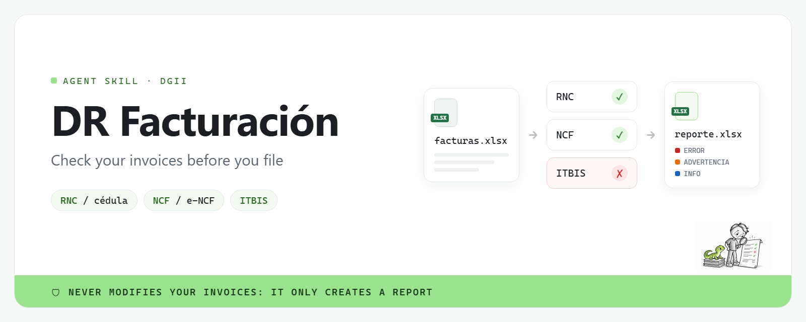
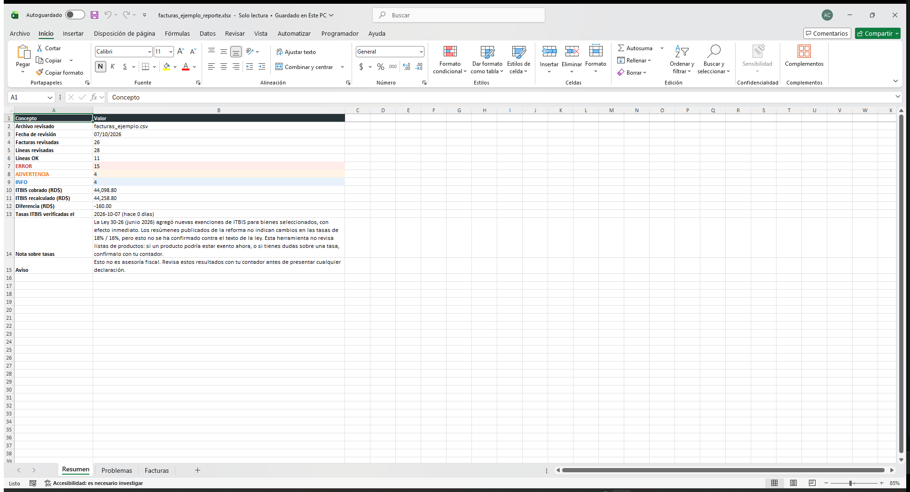
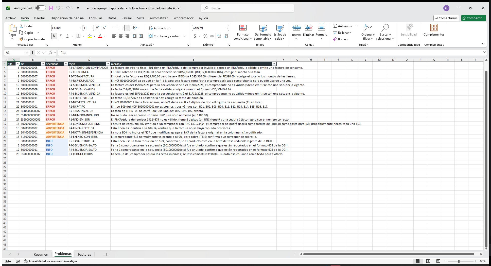
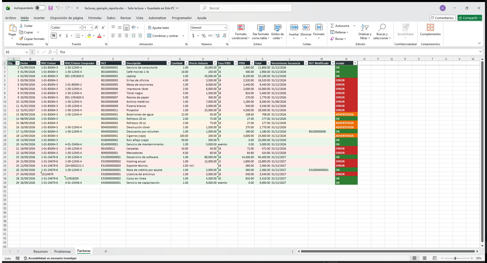

[Español](README.md) · **English**



<p align="center"><strong>Check the RNC, NCF/e-NCF and ITBIS on your invoices in seconds, and get an Excel report with every issue explained in plain Spanish.</strong></p>

**dr-facturacion** is a skill for AI agents (Claude Code, Codex and other agents that
support `SKILL.md`) that also works as a standalone command. It is built for businesses,
accountants and freelancers in the Dominican Republic who want to catch errors in their
fiscal receipts (comprobantes) before filing or sending them to their accountant. The
timing matters: the deadline for small and micro taxpayers to issue electronic fiscal
receipts (e-CF) is **November 15, 2026**
(DGII Aviso 06-26; [summary in Spanish](https://siemprealdia.co/republica-dominicana/impuestos/dgii-prorrogo-el-e-cf-para-pequenos-micros-y-no-clasificados/)).

> [!IMPORTANT]
> **It never modifies your invoice files**: it only reads them and writes a new report.
> **It doesn't connect to DGII or send your data anywhere**: everything runs on your computer.
> **Its results are not tax advice**: review them with your accountant before filing any return.

## How well has it been verified?

- **Rules checked against DGII sources on 2026-10-07** (the `last_verified` field in
  [`rules/itbis_rates.yaml`](rules/itbis_rates.yaml) and [`rules/ncf_types.yaml`](rules/ncf_types.yaml)):
  - [DGII: ITBIS](https://dgii.gov.do/cicloContribuyente/obligacionesTributarias/principalesImpuestos/Paginas/Itbis.aspx)
  - [DGII: Guía #7 ITBIS (PDF)](https://dgii.gov.do/publicacionesOficiales/bibliotecaVirtual/contribuyentes/itbis/Documents/1-Guia%207%20-%20%28ITBIS%29.pdf)
  - [DGII: Types of fiscal receipts](https://dgii.gov.do/cicloContribuyente/facturacion/comprobantesFiscales/Paginas/tiposComprobantes.aspx)
  - [DGII: Guía Informativa sobre Comprobantes Fiscales (PDF)](https://dgii.gov.do/publicacionesOficiales/bibliotecaVirtual/contribuyentes/facturacion/Documents/Comprobantes%20Fiscales/2-Guia-Informativa-NCF.pdf)
  - [DGII: Guía de Comprobantes Fiscales Especiales (PDF)](https://dgii.gov.do/publicacionesOficiales/bibliotecaVirtual/contribuyentes/facturacion/Documents/Comprobantes%20Fiscales/3-Guia-Comprobantes-Fiscales-Especiales-NG-05-19.pdf)
  - [DGII: Electronic fiscal receipts (e-CF)](https://dgii.gov.do/cicloContribuyente/facturacion/comprobantesFiscales/Paginas/comprobantesFiscalesElectronicos.aspx)
  - [DGII: Aviso 24-19, e-NCF structure (PDF)](https://dgii.gov.do/publicacionesOficiales/avisosInformativos/Documents/2019/24-19.pdf)
  - Check digits: [python-stdnum `stdnum.do.rnc`](https://arthurdejong.org/python-stdnum/doc/2.2/stdnum.do.rnc.html) and [`stdnum.do.cedula`](https://arthurdejong.org/python-stdnum/doc/2.2/stdnum.do.cedula.html)
- **140 automated tests**, with valid and invalid cases for every rule.
- **Tested only with the sample file** ([`examples/facturas_ejemplo.csv`](examples/facturas_ejemplo.csv)),
  not yet with real company invoices.
- The **sequence-gap and repeated-line** rules and the rounding **tolerances**
  (RD$0.01 per line, RD$0.05 per invoice) are this tool's own heuristics, not DGII rules.
- **Ley 30-26:** Ley 30-26 (June 2026) added new ITBIS exemptions for selected goods, effective immediately. Published summaries of the reform don't list changes to the 18% / 16% rates, but this hasn't been confirmed against the law's text. This tool doesn't check product lists: if a product may now be exempt, or if you're unsure about a rate, confirm with your accountant.
  ([Source: RSM, Law 30-26](https://www.rsm.global/dominicanrepublic/en/news/dominican-republic-tax-reform-law-30-26))

## What does it check?

| Check | What it catches | Severity |
|---|---|---|
| RNC / cédula | issuer or buyer RNC (9 digits) or cédula (11 digits) missing, malformed or with an invalid check digit; cédulas that lost their leading zeros in Excel | ERROR · INFO |
| NCF / e-NCF structure | NCF not following `B` + type + 8 digits, e-NCF not following `E` + type + 10 digits, receipt types that don't exist, pre-2018 format | ERROR |
| NCF type vs buyer | crédito fiscal (B01/E31) without a buyer RNC; consumo (B02/E32) issued to a company with an RNC; special regime or export (B14/E44, B16/E46) with ITBIS; debit/credit notes without the modified NCF | ERROR · ADVERTENCIA |
| Sequences | duplicate NCFs, repeated lines, expired sequences, numbering gaps (possible voided receipts for formato 608) | ERROR · ADVERTENCIA · INFO |
| ITBIS math | rates other than 18%, 16%, 0% or exempt; line ITBIS different from quantity × price × rate; unreadable amounts; 16% lines to confirm | ERROR · INFO |
| Totals | invoice total different from base + ITBIS | ERROR |
| Dates | missing, impossible (e.g. 31/02) or future dates | ERROR |

Each of the 20 rules is defined in [`scripts/check_invoices.py`](scripts/check_invoices.py) (the `RULES` dictionary).

## Why can you trust it?

1. **It never touches the input file.** It reads it into memory and writes a separate
   report; the tests verify with a hash that the file stays identical (CSV and Excel).
2. **Check digits are validated with [python-stdnum](https://arthurdejong.org/python-stdnum/)**,
   an open, maintained library, not home-made formulas.
3. **Rules live in editable YAML files** ([`rules/`](rules/)), with their verification date
   and sources. If the rates haven't been verified in more than 90 days, the tool warns you.
4. **Every issue explains what's wrong and what to do**, in plain Spanish, with the row number and NCF.

## Quick start

### 1. Requirements

Python 3.10 or newer and `pip`.

### 2. Install as a skill

**Claude Code (macOS / Linux)**

```bash
git clone https://github.com/alejandrocimentada/dr-facturacion.git
mkdir -p ~/.claude/skills/dr-facturacion
cp -R dr-facturacion/. ~/.claude/skills/dr-facturacion/
pip install -r ~/.claude/skills/dr-facturacion/requirements.txt
```

**Claude Code (Windows PowerShell)**

```powershell
git clone https://github.com/alejandrocimentada/dr-facturacion.git
New-Item -ItemType Directory -Force "$HOME\.claude\skills\dr-facturacion" | Out-Null
Copy-Item -Recurse -Force "dr-facturacion\*" "$HOME\.claude\skills\dr-facturacion\"
pip install -r "$HOME\.claude\skills\dr-facturacion\requirements.txt"
```

**Codex**

```bash
git clone https://github.com/alejandrocimentada/dr-facturacion.git
mkdir -p ~/.codex/skills/dr-facturacion
cp -R dr-facturacion/. ~/.codex/skills/dr-facturacion/
pip install -r ~/.codex/skills/dr-facturacion/requirements.txt
```

**As a standalone command (no agent)**

```bash
git clone https://github.com/alejandrocimentada/dr-facturacion.git
cd dr-facturacion
pip install -r requirements.txt
python scripts/check_invoices.py facturas.xlsx
```

The report is saved next to the file as `facturas_reporte.xlsx`. Other options:
`--sheet "Septiembre"` (Excel sheet), `--output revision.xlsx` (report path) and
`--map ncf="No. Comprobante"` (map a column that isn't recognized).

### 3. Use it in a conversation

> Use dr-facturacion to check my September invoices: facturas_septiembre.xlsx

The agent runs the check, explains the main issues grouped by severity with row numbers,
and tells you where the report is.

### 4. Template

Use [`templates/plantilla_facturas.xlsx`](templates/plantilla_facturas.xlsx): one row per
invoice line. Headers may be in Spanish or English (case, accents and punctuation are
ignored), and CSV or Excel both work.

| Column | Required | Description |
|---|---|---|
| `fecha` | yes | issue date (DD/MM/YYYY) |
| `rnc_emisor` | yes | issuer RNC or cédula |
| `rnc_comprador` | yes (may be empty for consumers) | buyer RNC or cédula |
| `ncf` | yes | NCF or e-NCF |
| `descripcion` | no | product or service |
| `cantidad` | yes | quantity |
| `precio_unitario` | yes | unit price **without** ITBIS |
| `tasa_itbis` | yes | `18`, `16`, `0` or `exento` |
| `itbis` | yes | ITBIS charged on the line |
| `total` | yes | line total (base + ITBIS) |
| `vencimiento_secuencia` | no | NCF sequence expiry date |
| `ncf_modificado` | no | original NCF, for debit/credit notes |

## What the report looks like

Report generated from [`examples/facturas_ejemplo.csv`](examples/facturas_ejemplo.csv):

**Resumen**: totals, severity counts, ITBIS charged vs recalculated



**Problemas**: one row per issue, sorted by severity



**Facturas**: original data with a color-coded `estado` column



## Known limitations

- **No online DGII lookup**: it can't confirm that an RNC is active or that an NCF was
  authorized, only that they are well-formed.
- **No product lists**: it doesn't know which products qualify for the 16% rate or are exempt.
- **No PDF support yet**: CSV and Excel (.xlsx) only.
- **No withholdings**: ITBIS and ISR withholdings are not covered (nor ISC or the legal tip).
- **Rules can change**: check the `last_verified` date in [`rules/`](rules/) before relying on the results.

## Customizing the rules

The rules live in two YAML files you can edit without touching the code:

- [`rules/itbis_rates.yaml`](rules/itbis_rates.yaml): accepted ITBIS rates (`general`,
  `reducida`, `exportacion`, `exento`), the Ley 30-26 note (`note` / `nota_es`) and their sources.
- [`rules/ncf_types.yaml`](rules/ncf_types.yaml): series (`B`, `E`) with their length, and the valid
  receipt types with their flags (`requires_buyer_id`, `consumer`, `usually_exempt`, `modifies`).

When you change something, **update `last_verified`** to today's date and **add the source**
under `sources`, so users know where each rule comes from.

## Development and validation

```bash
pip install -r requirements.txt pytest
python -m pytest                                          # 140 tests
python scripts/check_invoices.py examples/facturas_ejemplo.csv
python scripts/make_template.py                           # rebuild the Excel template
```

The sample file triggers all 20 rules at least once. The banner is generated from
[`docs/banner.html`](docs/banner.html).

## License

[MIT](LICENSE) © 2026 Alejandro Cimentada.
