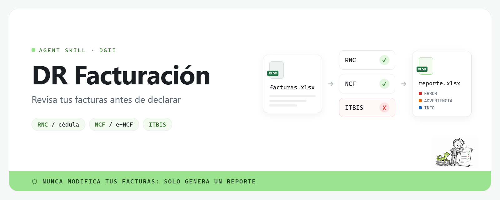

**Español** · [English](README.en.md)



<p align="center"><strong>Revisa RNC, NCF/e-NCF e ITBIS de tus facturas en segundos, y recibe un reporte en Excel con cada problema explicado en español.</strong></p>

**dr-facturacion** es una skill para agentes de IA (Claude Code, Codex y otros agentes
compatibles con `SKILL.md`) que también funciona como comando independiente. Está pensada
para empresas, contadores y profesionales independientes en República Dominicana que
quieren detectar errores en sus comprobantes antes de declarar o de enviarlos al contador.
Llega en buen momento: el plazo para que pequeños y micro contribuyentes emitan
comprobantes fiscales electrónicos (e-CF) vence el **15 de noviembre de 2026**
(Aviso 06-26 de la DGII; [resumen](https://siemprealdia.co/republica-dominicana/impuestos/dgii-prorrogo-el-e-cf-para-pequenos-micros-y-no-clasificados/)).

> [!IMPORTANT]
> **Nunca modifica tus archivos de facturas**: solo los lee y genera un reporte nuevo.
> **No se conecta a la DGII ni envía tus datos a ningún lugar**: todo se procesa en tu computadora.
> **Sus resultados no son asesoría fiscal**: revísalos con tu contador antes de presentar cualquier declaración.

## ¿Hasta qué punto está verificado?

- **Reglas verificadas contra fuentes de la DGII el 2026-10-07** (campo `last_verified` en
  [`rules/itbis_rates.yaml`](rules/itbis_rates.yaml) y [`rules/ncf_types.yaml`](rules/ncf_types.yaml)):
  - [DGII: ITBIS](https://dgii.gov.do/cicloContribuyente/obligacionesTributarias/principalesImpuestos/Paginas/Itbis.aspx)
  - [DGII: Guía #7 ITBIS (PDF)](https://dgii.gov.do/publicacionesOficiales/bibliotecaVirtual/contribuyentes/itbis/Documents/1-Guia%207%20-%20%28ITBIS%29.pdf)
  - [DGII: Tipos de comprobantes fiscales](https://dgii.gov.do/cicloContribuyente/facturacion/comprobantesFiscales/Paginas/tiposComprobantes.aspx)
  - [DGII: Guía Informativa sobre Comprobantes Fiscales (PDF)](https://dgii.gov.do/publicacionesOficiales/bibliotecaVirtual/contribuyentes/facturacion/Documents/Comprobantes%20Fiscales/2-Guia-Informativa-NCF.pdf)
  - [DGII: Guía de Comprobantes Fiscales Especiales (PDF)](https://dgii.gov.do/publicacionesOficiales/bibliotecaVirtual/contribuyentes/facturacion/Documents/Comprobantes%20Fiscales/3-Guia-Comprobantes-Fiscales-Especiales-NG-05-19.pdf)
  - [DGII: Comprobantes Fiscales Electrónicos (e-CF)](https://dgii.gov.do/cicloContribuyente/facturacion/comprobantesFiscales/Paginas/comprobantesFiscalesElectronicos.aspx)
  - [DGII: Aviso 24-19, estructura del e-NCF (PDF)](https://dgii.gov.do/publicacionesOficiales/avisosInformativos/Documents/2019/24-19.pdf)
  - Dígitos verificadores: [python-stdnum `stdnum.do.rnc`](https://arthurdejong.org/python-stdnum/doc/2.2/stdnum.do.rnc.html) y [`stdnum.do.cedula`](https://arthurdejong.org/python-stdnum/doc/2.2/stdnum.do.cedula.html)
- **140 pruebas automáticas**, con casos válidos e inválidos para cada regla.
- **Probado solo con el archivo de ejemplo** ([`examples/facturas_ejemplo.csv`](examples/facturas_ejemplo.csv)),
  todavía no con facturas reales de empresas.
- Las reglas de **saltos de secuencia y líneas repetidas**, y las **tolerancias** de redondeo
  (RD$0.01 por línea, RD$0.05 por factura), son heurísticas de esta herramienta, no reglas de la DGII.
- **Ley 30-26:** La Ley 30-26 (junio 2026) agregó nuevas exenciones de ITBIS para bienes seleccionados, con efecto inmediato. Los resúmenes publicados de la reforma no indican cambios en las tasas de 18% / 16%, pero esto no se ha confirmado contra el texto de la ley. Esta herramienta no revisa listas de productos: si un producto podría estar exento ahora, o si tienes dudas sobre una tasa, confírmalo con tu contador.
  ([Fuente: RSM, Ley 30-26](https://www.rsm.global/dominicanrepublic/en/news/dominican-republic-tax-reform-law-30-26))

## ¿Qué revisa?

| Revisión | Qué detecta | Severidad |
|---|---|---|
| RNC / cédula | RNC (9 dígitos) o cédula (11 dígitos) del emisor o comprador vacío, mal formado o con dígito verificador inválido; cédulas que perdieron los ceros iniciales en Excel | ERROR · INFO |
| Estructura NCF / e-NCF | NCF que no sigue `B` + tipo + 8 dígitos, e-NCF que no sigue `E` + tipo + 10 dígitos, tipos de comprobante que no existen, formato anterior a 2018 | ERROR |
| Tipo de NCF vs comprador | crédito fiscal (B01/E31) sin RNC del comprador; consumo (B02/E32) emitido a una empresa con RNC; régimen especial o exportación (B14/E44, B16/E46) con ITBIS; notas de débito/crédito sin NCF modificado | ERROR · ADVERTENCIA |
| Secuencias | NCF duplicados, líneas repetidas, secuencias vencidas, saltos en la numeración (posibles anulados para el formato 608) | ERROR · ADVERTENCIA · INFO |
| Cálculo de ITBIS | tasas que no son 18%, 16%, 0% o exento; ITBIS de la línea distinto de cantidad × precio × tasa; montos ilegibles; líneas al 16% para confirmar | ERROR · INFO |
| Totales | total de la factura distinto de base + ITBIS | ERROR |
| Fechas | fechas vacías, inexistentes (p. ej. 31/02) o en el futuro | ERROR |

El detalle de cada una de las 20 reglas está en [`scripts/check_invoices.py`](scripts/check_invoices.py) (diccionario `RULES`).

## ¿Por qué es confiable?

1. **Nunca toca el archivo de entrada.** Lo lee en memoria y escribe un reporte aparte; las
   pruebas verifican con un hash que el archivo queda idéntico (CSV y Excel).
2. **Los dígitos verificadores se validan con [python-stdnum](https://arthurdejong.org/python-stdnum/)**,
   una biblioteca abierta y mantenida, no con fórmulas propias.
3. **Las reglas viven en archivos YAML editables** ([`rules/`](rules/)), con su fecha de
   verificación y sus fuentes. Si las tasas tienen más de 90 días sin verificarse, la herramienta lo avisa.
4. **Cada problema explica qué está mal y qué hacer**, en español sencillo, con el número de fila y el NCF.

## Inicio rápido

### 1. Requisitos

Python 3.10 o superior y `pip`.

### 2. Instalar como skill

**Claude Code (macOS / Linux)**

```bash
git clone https://github.com/alejandrocimentada/dr-facturacion.git
mkdir -p ~/.claude/skills/dr-facturacion
cp -R dr-facturacion/. ~/.claude/skills/dr-facturacion/
pip install -r ~/.claude/skills/dr-facturacion/requirements.txt
```

**Claude Code (Windows PowerShell)**

```powershell
git clone https://github.com/alejandrocimentada/dr-facturacion.git
New-Item -ItemType Directory -Force "$HOME\.claude\skills\dr-facturacion" | Out-Null
Copy-Item -Recurse -Force "dr-facturacion\*" "$HOME\.claude\skills\dr-facturacion\"
pip install -r "$HOME\.claude\skills\dr-facturacion\requirements.txt"
```

**Codex**

```bash
git clone https://github.com/alejandrocimentada/dr-facturacion.git
mkdir -p ~/.codex/skills/dr-facturacion
cp -R dr-facturacion/. ~/.codex/skills/dr-facturacion/
pip install -r ~/.codex/skills/dr-facturacion/requirements.txt
```

**Como comando independiente (sin agente)**

```bash
git clone https://github.com/alejandrocimentada/dr-facturacion.git
cd dr-facturacion
pip install -r requirements.txt
python scripts/check_invoices.py facturas.xlsx
```

El reporte se guarda junto al archivo como `facturas_reporte.xlsx`. Otras opciones:
`--sheet "Septiembre"` (hoja de Excel), `--output revision.xlsx` (ruta del reporte) y
`--map ncf="No. Comprobante"` (asignar una columna que no se reconoce).

### 3. Úsalo en una conversación

> Usa dr-facturacion para revisar mis facturas de septiembre: facturas_septiembre.xlsx

El agente ejecuta la revisión, te explica los problemas principales agrupados por severidad
con los números de fila, y te indica dónde está el reporte.

### 4. Plantilla

Usa [`templates/plantilla_facturas.xlsx`](templates/plantilla_facturas.xlsx): una fila por
cada línea de factura. Los encabezados pueden estar en español o inglés (se ignoran
mayúsculas, acentos y signos), y CSV o Excel funcionan igual.

| Columna | Obligatoria | Descripción |
|---|---|---|
| `fecha` | sí | fecha de emisión (DD/MM/AAAA) |
| `rnc_emisor` | sí | RNC o cédula de quien emite |
| `rnc_comprador` | sí (puede ir vacía en consumo) | RNC o cédula del comprador |
| `ncf` | sí | NCF o e-NCF |
| `descripcion` | no | producto o servicio |
| `cantidad` | sí | cantidad |
| `precio_unitario` | sí | precio unitario **sin** ITBIS |
| `tasa_itbis` | sí | `18`, `16`, `0` o `exento` |
| `itbis` | sí | ITBIS cobrado en la línea |
| `total` | sí | total de la línea (base + ITBIS) |
| `vencimiento_secuencia` | no | vencimiento de la secuencia de NCF |
| `ncf_modificado` | no | NCF original, en notas de débito/crédito |

## Cómo se ve el reporte

Reporte generado a partir de [`examples/facturas_ejemplo.csv`](examples/facturas_ejemplo.csv):

**Resumen**: totales, cantidad por severidad, ITBIS cobrado vs recalculado


**Problemas**: una fila por problema, ordenadas por severidad


**Facturas**: datos originales con la columna `estado` en colores


## Límites conocidos

- **No consulta a la DGII en línea**: no puede confirmar que un RNC esté activo ni que un NCF
  haya sido autorizado, solo que estén bien formados.
- **No revisa listas de productos**: no sabe qué productos tienen tasa de 16% o están exentos.
- **Todavía no lee PDF**: solo CSV y Excel (.xlsx).
- **No cubre retenciones** de ITBIS ni de ISR (ni ISC o propina legal).
- **Las reglas pueden cambiar**: revisa la fecha `last_verified` en [`rules/`](rules/) antes de confiar en los resultados.

## Personalizar las reglas

Las reglas están en dos archivos YAML que puedes editar sin tocar el código:

- [`rules/itbis_rates.yaml`](rules/itbis_rates.yaml): tasas de ITBIS aceptadas (`general`,
  `reducida`, `exportacion`, `exento`), la nota sobre la Ley 30-26 (`note` / `nota_es`) y sus fuentes.
- [`rules/ncf_types.yaml`](rules/ncf_types.yaml): series (`B`, `E`) con su longitud, y los tipos de
  comprobante válidos con sus marcas (`requires_buyer_id`, `consumer`, `usually_exempt`, `modifies`).

Cuando cambies algo, **actualiza `last_verified`** con la fecha de hoy y **agrega la fuente**
en `sources`, para que quien use la herramienta sepa de dónde sale cada regla.

## Desarrollo y validación

```bash
pip install -r requirements.txt pytest
python -m pytest                                          # 140 pruebas
python scripts/check_invoices.py examples/facturas_ejemplo.csv
python scripts/make_template.py                           # regenera la plantilla de Excel
```

El archivo de ejemplo activa las 20 reglas al menos una vez. El banner se genera desde
[`docs/banner.html`](docs/banner.html).

## Licencia

[MIT](LICENSE) © 2026 Alejandro Cimentada.
